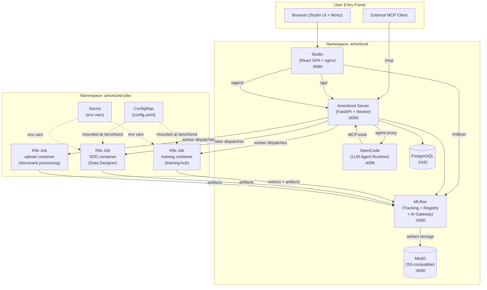
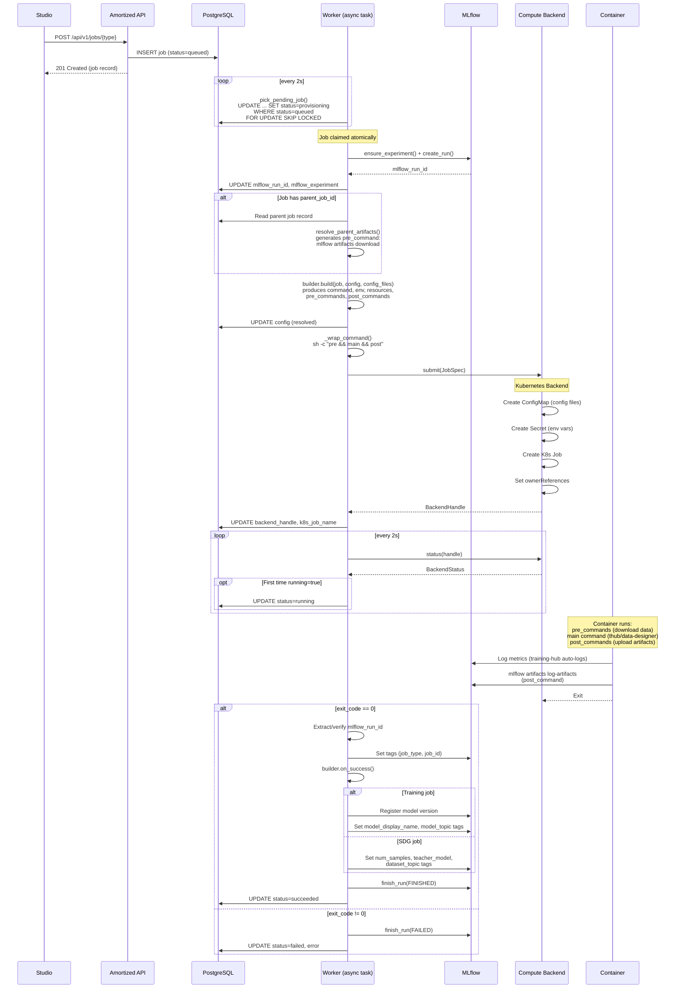
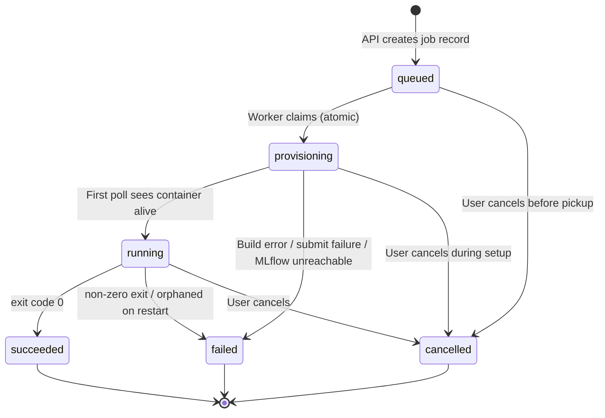
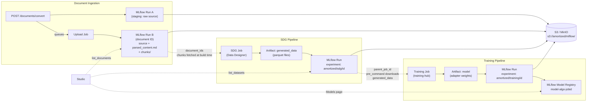
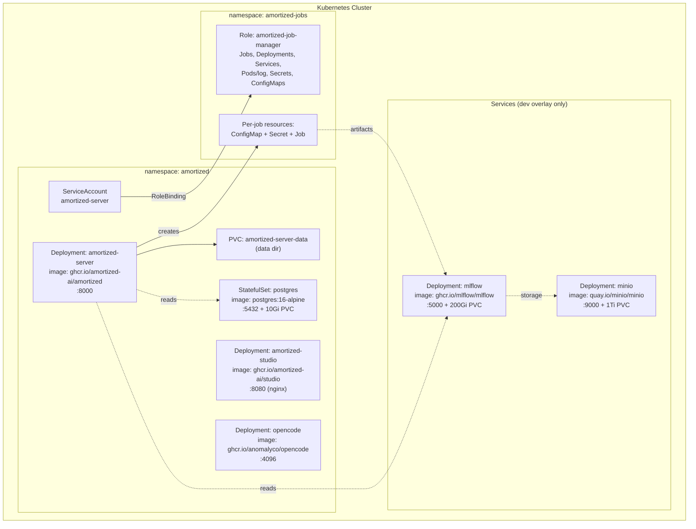
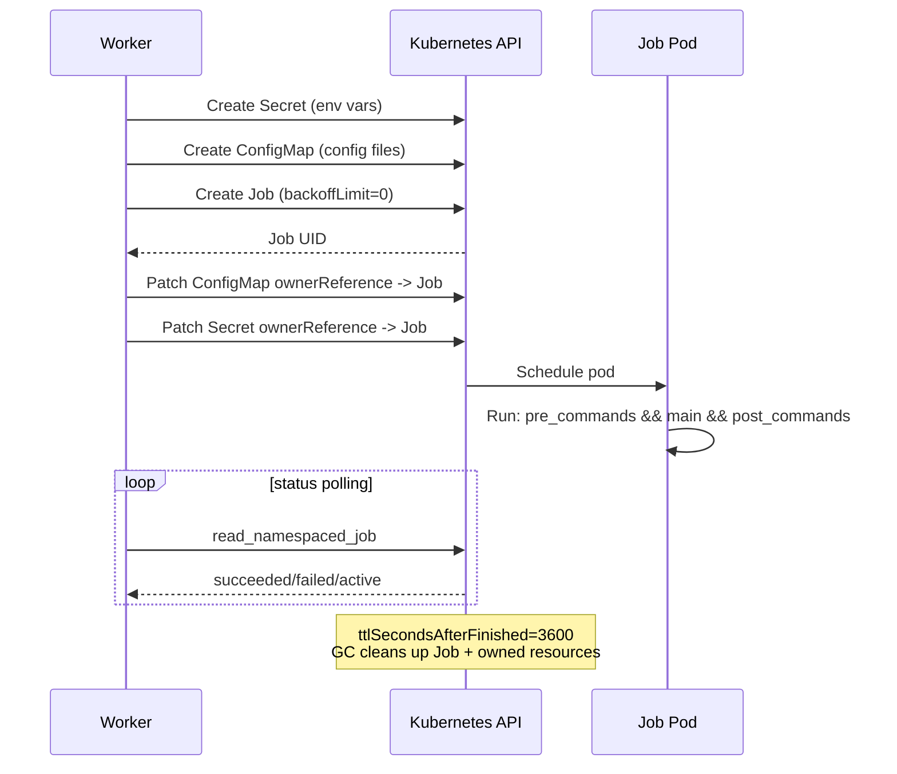
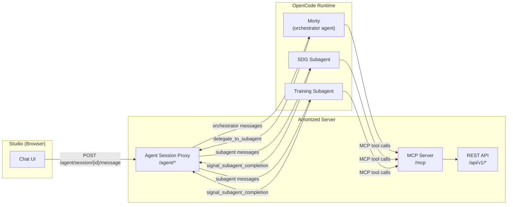

# Amortized Architecture

Amortized is a control plane for building task models on OpenShift. A user describes a task their AI agent handles with a frontier model (classification, extraction, routing, summarization), and Amortized produces a small fine-tuned model that does it cheaper, faster, and on their infrastructure. It is a thin orchestration layer: it translates user intent into tool-native YAML configs, dispatches K8s Jobs, and tracks job lifecycle. Everything else is delegated: `MLflow` for artifacts and lineage, `S3/MinIO` for storage, `Kubernetes` for compute, `training-hub` for training algorithms, and `Data Designer` for synthetic data generation.

---

## 1. System Architecture



---

## 2. Component Details

### 2.1 Studio (Frontend)

React 19 + Vite SPA served by nginx. Nginx acts as a reverse proxy for three upstreams.

| Upstream | Route | Target |
|---|---|---|
| Amortized API | `/api/` | `amortized-server:8000` |
| Agent proxy | `/agent/` | `amortized-server:8000` |
| MLflow REST API | `/mlflow/` | `mlflow:5000` |

Studio pages: Overview, Chat (Morty), Jobs, Datasets, Documents, Models, Recipes, Settings.

The Models page queries MLflow's Model Registry directly through the nginx proxy. Datasets and Documents query the Amortized API, which in turn queries MLflow run searches. The Chat page communicates with Morty through the agent proxy on the server.

Port: **8080** (nginx container).

### 2.2 Amortized Server

FastAPI application running on port **8000**. Houses three subsystems in one process:

1. **REST API** -- job CRUD, recipes, documents, datasets, artifacts, costs, schemas, models, UI tools. All endpoints under `/api/v1/`.
2. **Worker** -- background asyncio task started by the FastAPI lifespan handler. Polls PostgreSQL for queued jobs, dispatches them to the compute backend, polls for completion, and handles post-completion logic (MLflow tagging, model registration).
3. **MCP Server** -- auto-generated from the OpenAPI spec via `fastapi-mcp`. Mounted at `/mcp`. Exposes API endpoints as MCP tools for Morty, with job creation endpoints explicitly excluded (human-in-the-loop enforcement).

The server also acts as an **agent session proxy**: `/agent/*` endpoints proxy chat sessions between Studio and the OpenCode runtime, intercepting delegation and completion signals for subagent routing.

Configuration: environment variables with `AMORTIZED_` prefix via pydantic-settings.

### 2.3 OpenCode (Agent Runtime)

Runs the Morty AI assistant. OpenCode is an LLM agent runtime (`ghcr.io/anomalyco/opencode`) that serves on port **4096** and hosts custom agents defined by prompt files.

Three agents are configured:
- **morty** -- orchestrator agent, handles user conversation flow
- **sdg** -- subagent for synthetic data generation workflows
- **training** -- subagent for training workflows

Agent prompts and skills are delivered as K8s ConfigMaps. An init container reconstructs the flat ConfigMap entries into the directory tree OpenCode expects (`skills/<type>/<use-case>/`).

LLM provider: Vertex AI (GCP credentials mounted as a Secret). Dev overlay can use OpenAI instead.

### 2.4 PostgreSQL

Stores job records. StatefulSet with a 10Gi PVC. Single `jobs` table tracking job lifecycle, config, status, and links to MLflow runs and compute backend handles.

Port: **5432**. Connection string passed via `AMORTIZED_DATABASE_URL`.

### 2.5 MLflow

Serves three roles:

1. **Experiment Tracking** -- each job creates an MLflow run under an experiment named `amortized/<job_type>/<job_id[:8]>`. Runs carry tags (`job_type`, `job_id`, `teacher_model`, `dataset_topic`, `model_display_name`) that power the Studio browse pages.
2. **Artifact Store** -- datasets, model weights, and document chunks are stored as MLflow artifacts, backed by S3/MinIO. MLflow proxies artifact upload/download via its artifacts API.
3. **AI Gateway** -- routes LLM API calls to configured providers (OpenAI, Anthropic, etc.) with centralized key management. The Gateway endpoint list is what populates the teacher model picker in Studio.
4. **Model Registry** -- successful training jobs register model versions, which the Models page queries directly.

Port: **5000**. Artifact root: `s3://amortized/mlflow/`.

### 2.6 MinIO

S3-compatible object storage. Backing store for MLflow artifacts. Single bucket `amortized`.

Port: **9000** (API), **9001** (console). 1Ti PVC in dev overlay.

### 2.7 K8s Jobs (Compute)

Training and SDG workloads run as K8s Jobs in the `amortized-jobs` namespace (separate from the platform namespace). Each job creates three resources:

| Resource | Purpose |
|---|---|
| ConfigMap | YAML config files, mounted read-only at `/amortized` |
| Secret | Environment variables (MLflow URI, S3 credentials, etc.) |
| Job | The actual container with `backoffLimit: 0`, `ttlSecondsAfterFinished: 3600` |

ConfigMap and Secret have `ownerReferences` pointing to the Job, so K8s garbage-collects them when the Job is deleted.

Container images:
- Training: `ghcr.io/amortized-ai/training:latest` (runs `thub <algorithm> --config /amortized/config.yaml`)
- SDG: `ghcr.io/amortized-ai/data-designer:latest` (runs `data-designer create /amortized/config.yaml`)

GPU jobs get `nvidia.com/gpu` resource requests, `nodeSelector: nvidia.com/gpu.present=true`, and `runtimeClassName: nvidia`.

---

## 3. Job Lifecycle



### 3.1 Job Status State Machine



### 3.2 Job Types

| Type | Image | Command | Produces |
|---|---|---|---|
| `sdg` | `ghcr.io/amortized-ai/data-designer:latest` | `data-designer create /amortized/config.yaml --num-records N --artifact-path /amortized/work --no-tui` | Dataset (MLflow artifact `generated_data`) |
| `training` | `ghcr.io/amortized-ai/training:latest` | `thub <algorithm> --config /amortized/config.yaml` | Model (MLflow artifact `model` + Registry entry) |
| `upload` | internal | Document processing | Parsed content + chunks (MLflow artifacts) |
| `eval` | defined but no builder | Evaluation via LLM judge | (not yet implemented) |

Training algorithms: `sft`, `lora_sft` (aliases: `lora`, `qlora`, `qlora_sft`), `osft`, `dpo`, `grpo`, `lora_grpo`, `kto`, `gkd`, `gepa`.

---

## 4. Artifact Flow



### 4.1 Job Chaining (parent_job_id)

A training job can reference a completed SDG job via `parent_job_id`. At dispatch time, the worker:

1. Looks up the parent job's `mlflow_run_id`
2. Generates a pre-command: `mlflow artifacts download -r <parent_run_id> -a generated_data -d /amortized/work/data`
3. Sets `data_path` in the training config to `/amortized/work/data/generated_data`

This pre-command runs inside the container before the main training command, downloading the dataset from MLflow's artifact store.

Chaining is one hop only (SDG/upload -> training). There is no DAG engine.

### 4.2 Documents as SDG Seed Data

When an SDG job includes `document_ids`:
1. The SDG builder fetches chunks from MLflow at build time
2. Chunks are written as ConfigMap entries (`chunk_0.md`, `chunk_1.md`, ...)
3. A pre-command copies chunks to `/tmp/chunks` inside the container
4. Data Designer's `seed_config` is set to `seed_type: file_contents`, `path: /tmp/chunks`

---

## 5. K8s Deployment Topology



### 5.1 Kustomize Structure

```
k8s/
  base/                    # Core platform workloads
    server-deployment.yaml
    studio-deployment.yaml
    opencode-deployment.yaml
    configmap.yaml         # AMORTIZED_* env vars
    rbac.yaml              # Role + RoleBinding for amortized-jobs namespace
    serviceaccount.yaml
    server-pvc.yaml
    *-service.yaml

  services/                # Infrastructure services
    postgres.yaml          # StatefulSet + Service
    mlflow.yaml            # Deployment + PVC + Service
    minio.yaml             # Deployment + PVC + Service
    minio-init.yaml        # Job to create initial bucket
    s3-secret.yaml         # S3 credentials

  overlays/
    dev/                   # Single-user development
      kustomization.yaml   # Includes base + services, patches config
      s3-secret-jobs.yaml  # S3 credentials for amortized-jobs namespace
      postgres.yaml        # Dev postgres config

    rosa/                  # OpenShift/ROSA production
      kustomization.yaml   # Includes base only (BYO services)
      studio-route.yaml    # OpenShift Route for Studio
```

**Dev overlay**: bundles all services (MLflow, MinIO, PostgreSQL). Sets `AMORTIZED_MLFLOW_TRACKING_URI`, `AMORTIZED_GATEWAY_URL`, `AMORTIZED_DATABASE_URL`. Relaxes `runAsNonRoot` and sets `imagePullPolicy: IfNotPresent`.

**ROSA overlay**: brings only the base. Production environments provide their own MLflow, S3, and PostgreSQL. Adds an OpenShift Route for Studio.

### 5.2 RBAC

The `amortized-server` ServiceAccount in the `amortized` namespace has a Role bound in the `amortized-jobs` namespace granting:

| API Group | Resources | Verbs |
|---|---|---|
| `batch` | Jobs | create, get, list, watch, delete |
| `apps` | Deployments | create, get, list, watch, delete |
| `""` | Services | create, get, list, delete |
| `""` | Pods, Pods/log | get, list, watch |
| `""` | Secrets, ConfigMaps | create, get, patch, delete |

No ClusterRole. The server can only operate in the designated jobs namespace.

---

## 6. Compute Backend Architecture

Compute is abstracted behind the `ComputeBackend` protocol -- the seam that keeps job dispatch backend-agnostic:

```python
class ComputeBackend(Protocol):
    name: str
    def capabilities(self) -> set[Capability]: ...
    async def submit(self, spec: JobSpec) -> BackendHandle: ...
    async def status(self, handle: BackendHandle) -> BackendStatus: ...
    async def cancel(self, handle: BackendHandle) -> None: ...
    def logs(self, handle: BackendHandle) -> AsyncIterator[str]: ...
```

The job builders produce a single `JobSpec` -- command, config files, env, resources -- with no backend-specific branching, so any implementation of the protocol can run it. **Kubernetes is the implementation used in all deployments**; the protocol exists so additional backends can be added later without touching the builders or the worker.

### 6.1 Kubernetes Backend

For each job:



Pod volumes:
- `config` -- ConfigMap mounted read-only at `/amortized`
- `work` -- hostPath at `/var/local-path-provisioner/job-work/<job_id>` mounted at `/amortized/work`
- `shm` -- 12Gi memory-backed emptyDir at `/dev/shm` (PyTorch dataloaders)

Environment: S3 credentials via `envFrom` on `amortized-s3` Secret, per-job vars via dedicated Secret with `secretKeyRef`, cache dirs (`HF_HOME`, `TRANSFORMERS_CACHE`) redirected into the work volume.

### 6.2 Backend Registration

The Kubernetes backend is registered at startup in the FastAPI lifespan when `AMORTIZED_COMPUTE_BACKEND=kubernetes`. The active backend for job dispatch is resolved from `AMORTIZED_DEFAULT_BACKEND` (falling back to `AMORTIZED_COMPUTE_BACKEND`).

---

## 7. Agent Architecture (Morty)



### 7.1 Session Proxy

The Amortized server proxies chat between Studio and OpenCode. Each user session maps to:
- One **orchestrator** OpenCode session (Morty)
- Zero or one **subagent** OpenCode session (SDG or Training)

The proxy intercepts two internal tool calls in the agent's responses:
- `delegate_to_subagent(target, context)` -- creates a new OpenCode session for the target agent
- `signal_subagent_completion(summary)` -- tears down the subagent, resumes the orchestrator with a summary

Sessions expire after 4 hours of inactivity.

### 7.2 MCP Tool Exposure

`fastapi-mcp` auto-generates MCP tools from the OpenAPI spec. Three operations are explicitly excluded to enforce human-in-the-loop:
- `create_sdg_job`
- `create_training_job`
- `submit_recipe_job`

The agent can only **validate** job configs (via `validate_sdg_job`, `validate_training_job`). The frontend renders a confirmation card, and only user confirmation triggers the actual job creation call.

### 7.3 UI Tool Pattern

Morty renders UI components by calling "tools" that are really display hints:
- `present_options` -- rendered as clickable option cards
- `show_model_pricing` -- rendered as a pricing comparison table
- `show_vram_estimate` -- rendered as a VRAM comparison table
- `signal_phase` -- rendered as a workflow progress indicator

These are `/api/v1/ui/*` endpoints that echo their inputs; the real effect is that Studio intercepts the tool call and renders the corresponding component.

### 7.4 Skill Delivery

Agent skills (guides and reference payloads) are delivered as K8s ConfigMaps with flat-file naming (`sdg__classification__guide.md`). An init container on the OpenCode pod reconstructs the directory tree:

```
skills/
  sdg/
    classification/guide.md
    knowledge-ingestion/guide.md
    knowledge-ingestion/reference-payload.json
  training/
    knowledge-ingestion/osft/guide.md
    knowledge-ingestion/osft/reference-payload.json
    knowledge-ingestion/osft/training-config-template.json
    supported_models.json
```

---

## 8. Data Model

### 8.1 Jobs Table

The single source of truth for job lifecycle. PostgreSQL via asyncpg.

```sql
CREATE TABLE jobs (
    id                TEXT PRIMARY KEY,       -- UUID
    type              TEXT NOT NULL,          -- sdg | training | upload | eval
    status            TEXT NOT NULL           -- queued | provisioning | running |
                          DEFAULT 'queued',   -- succeeded | failed | cancelled
    config            JSONB NOT NULL          -- job config (secrets stripped)
                          DEFAULT '{}'::jsonb,
    recipe            TEXT DEFAULT '',        -- recipe name if submitted via recipe
    user_id           TEXT DEFAULT '',        -- from X-Forwarded-User header
    k8s_job_name      TEXT DEFAULT '',        -- K8s Job resource name
    k8s_namespace     TEXT DEFAULT '',        -- target namespace
    mlflow_run_id     TEXT DEFAULT '',        -- links to MLflow run
    mlflow_experiment TEXT DEFAULT '',        -- MLflow experiment path
    parent_job_id     TEXT DEFAULT '',        -- SDG -> Training chaining
    error             TEXT DEFAULT '',        -- failure reason
    created_at        TIMESTAMPTZ NOT NULL,
    started_at        TIMESTAMPTZ,
    completed_at      TIMESTAMPTZ,
    backend_handle    TEXT DEFAULT ''         -- serialized BackendHandle JSON
);
```

Key relationships:
- `parent_job_id` references another row in the same table (SDG -> Training chain)
- `mlflow_run_id` is the foreign key into MLflow (not enforced by FK constraint)
- `backend_handle` is a serialized JSON blob containing backend-specific identifiers (for Kubernetes, the Job resource name)

Schema evolution: Alembic migrations. `0001` created the initial schema, `0002` converted `config` to JSONB and timestamps to TIMESTAMPTZ.

---

## 9. API Surface

All endpoints under `/api/v1/` unless noted.

### Jobs

| Method | Path | Operation ID | Notes |
|---|---|---|---|
| POST | `/jobs/sdg` | `create_sdg_job` | Creates SDG job. Not exposed via MCP. |
| POST | `/jobs/training` | `create_training_job` | Creates training job. Not exposed via MCP. |
| POST | `/jobs/sdg/validate` | `validate_sdg_job` | Validates without creating. Used by Morty. |
| POST | `/jobs/training/validate` | `validate_training_job` | Validates without creating. Used by Morty. |
| GET | `/jobs` | `list_jobs` | Filter by status, type. |
| GET | `/jobs/{id}` | `get_job` | Full job details. |
| DELETE | `/jobs/{id}` | `cancel_job` | Cancel running/queued job. |
| POST | `/jobs/{id}/delete` | `delete_job` | Permanent delete (terminal jobs only). |
| GET | `/jobs/{id}/logs` | `get_job_logs` | Container logs (last N lines). |
| GET | `/jobs/{id}/artifacts` | `get_job_artifacts` | MLflow artifact URI. |

### Recipes

| Method | Path | Operation ID |
|---|---|---|
| GET | `/recipes` | `list_recipes` |
| GET | `/recipes/{name}` | `get_recipe` |
| PUT | `/recipes/{name}` | `save_recipe` |
| DELETE | `/recipes/{name}` | `delete_recipe` |
| POST | `/jobs/recipe` | `submit_recipe_job` (not MCP) |
| POST | `/jobs/recipe/validate` | `validate_recipe_job` |

### Datasets and Documents

| Method | Path | Operation ID |
|---|---|---|
| GET | `/datasets` | `list_datasets` |
| GET | `/datasets/{id}` | `get_dataset` |
| GET | `/datasets/{id}/samples` | `get_dataset_samples` |
| POST | `/datasets/upload` | (upload dataset) |
| POST | `/documents/convert` | `convert_document` |
| POST | `/documents/convert/url` | `convert_document_url` |
| GET | `/documents` | `list_documents` |
| GET | `/documents/{id}/content` | `get_document_content` |
| GET | `/documents/{id}/chunks` | `get_document_chunks` |
| DELETE | `/documents/{id}` | `delete_document` |

### Other

| Method | Path | Operation ID | Notes |
|---|---|---|---|
| GET | `/models` | `list_models` | MLflow AI Gateway endpoints |
| GET | `/schemas` | `get_schemas` | JSON schemas for SDG/Training configs |
| GET | `/artifacts/{exp}/{run}` | `list_artifacts` | S3 artifact proxy |
| GET | `/artifacts/{exp}/{run}/{path}` | `get_artifact_content` | S3 artifact proxy |
| GET | `/costs/models` | `get_model_pricing` | OpenRouter pricing data |
| POST | `/costs/training/estimate` | `estimate_training_resources` | VRAM/time estimation |
| POST | `/ui/present_options` | `present_options` | Agent UI tool |
| POST | `/ui/show_model_pricing` | `show_model_pricing` | Agent UI tool |
| POST | `/ui/show_vram_estimate` | `show_vram_estimate` | Agent UI tool |
| POST | `/ui/signal_phase` | `signal_phase` | Agent UI tool |
| GET | `/health` | `health` | Health check |
| GET | `/config` | `get_config` | Server configuration |

### Non-API Routes

| Path | Purpose |
|---|---|
| `/agent/session` | Agent session proxy (POST create, GET/POST messages) |
| `/agent/health` | Agent runtime health check |
| `/mcp` | MCP tool server (SSE transport) |

### Authentication

Optional bearer token via `AMORTIZED_API_KEY`. When unset (default), the API is open. `X-Forwarded-User` is stored as `user_id` on job records but not enforced.

---

## 10. Config Translation Detail

### Training Config

The API uses conventional field names. The training builder translates them to training-hub's dialect:

| API Field | training-hub Field |
|---|---|
| `model_name_or_path` | `model_path` |
| `num_train_epochs` | `num_epochs` |
| `per_device_train_batch_size` | `micro_batch_size` |
| `max_length` | `max_seq_len` |
| `output_dir` | `ckpt_output_dir` |

Algorithm-specific defaults are applied:
- SFT/LoRA SFT: `effective_batch_size = micro_batch_size * 4`, `max_seq_len = 2048`, `max_batch_len = 60000`
- OSFT: adds `max_tokens_per_gpu = 4096`, `learning_rate = 2e-5`

### SDG Config

No translation needed. `SDGJobRequest` imports Data Designer's own Pydantic types (`ColumnConfigT`, `ModelConfig`, `ProcessorConfigT`, `ToolConfig`) and validates against them directly. The builder strips legacy keys and wraps the config under `data_designer:` for Data Designer's YAML format.

---

## 11. Recovery and Cleanup

### Server Restart

On startup, `cleanup_orphaned_jobs()` scans all jobs with `status=running` in the configured namespace. For each:
1. Deserializes `backend_handle`
2. Asks the backend if the job is still alive
3. If alive: re-adopts (continues polling)
4. If dead: marks as failed with "Orphaned job -- process no longer running"

### Resource Cleanup

- **K8s**: `ownerReferences` ensure ConfigMaps and Secrets are garbage-collected when the Job is deleted. `ttlSecondsAfterFinished=3600` auto-deletes completed Jobs after 1 hour.
- **MLflow**: failed runs are marked `FAILED` via `finish_run`. No artifact cleanup on cancellation.
