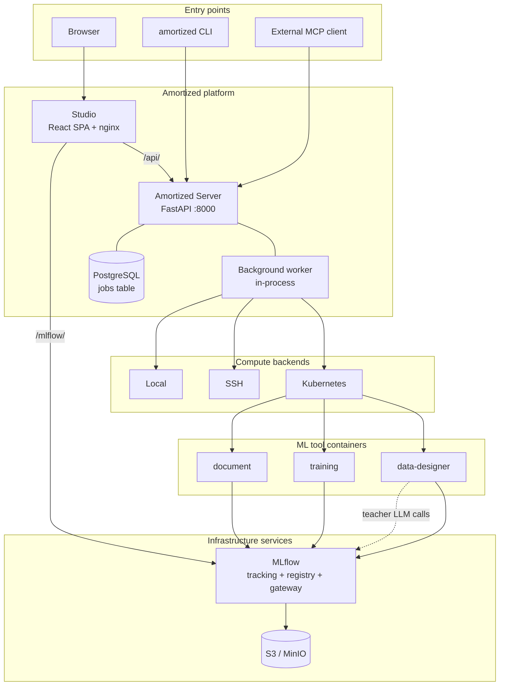
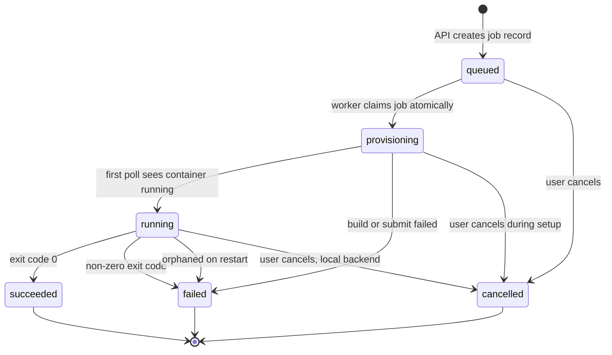
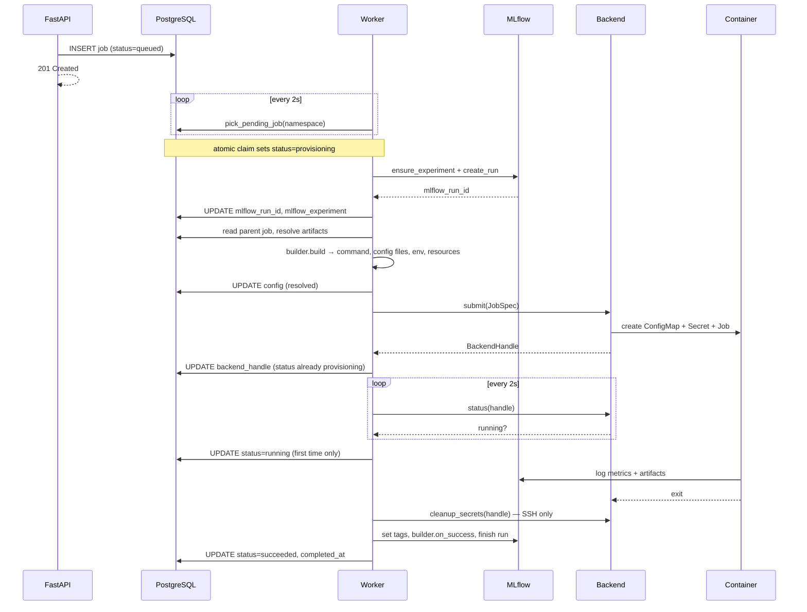
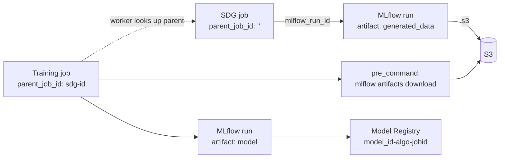
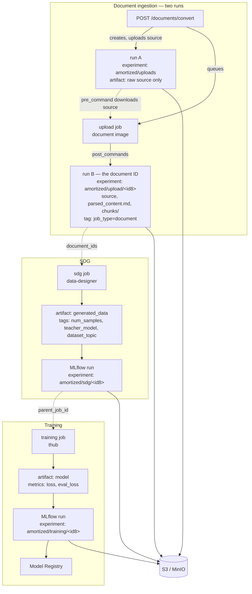
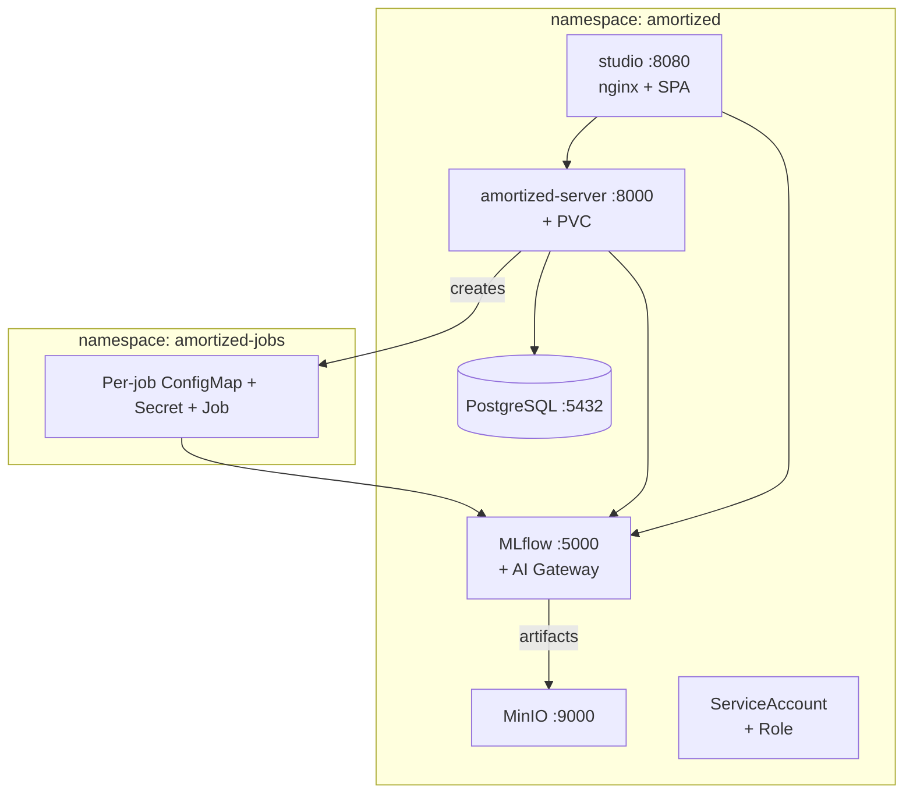

# Amortized Architecture

*Architecture and system description, as built.*

---

## 1. What Amortized is

Every AI agent has tasks that don't need a frontier model. Classification, extraction, routing, summarization — specific, repeatable, learnable. A small fine-tuned model does them faster and cheaper, on infrastructure you control.

Amortized builds those models. The user describes a task in conversation; the platform generates training data from a teacher model, fine-tunes a small student model, and hands back a model registered in MLflow. The name is the thesis: amortization spreads a large upfront cost across many future uses. The upfront cost is the frontier model's capability; the uses are every future inference by the cheap task model.

Architecturally, Amortized is a **thin orchestration layer**. It translates user intent into tool-native YAML, dispatches Kubernetes Jobs, and tracks their lifecycle. Everything else is delegated:

| Concern | Owner |
|---|---|
| Artifacts, metrics, lineage, model registry | MLflow |
| Artifact storage | S3 / MinIO |
| Compute | Kubernetes |
| Synthetic data generation | Data Designer |
| Training algorithms | training-hub |
| LLM provider routing and keys | MLflow AI Gateway |
| Serving | Red Hat MaaS (out of scope) |

What Amortized itself owns is small and deliberate: one `jobs` table, a config translator per job type, a dispatch-and-poll worker, a REST + MCP API, an agent, and a web UI.

---

## 2. System map



Studio is the only UI users touch. It proxies two upstreams through nginx — the Amortized API and MLflow's REST API — and calls both directly from the browser. When an agent is deployed, Studio can also proxy chat requests to it via `/agent/`. MLflow's own UI stays available for platform engineers but is not part of the product surface.

The agent service (`agent/server.py`) is built on the Claude Agent SDK and communicates with the Amortized server exclusively through MCP. It is not deployed by the base k8s manifests — it runs as a separate service when needed.

The worker runs **in-process** inside the FastAPI server as an asyncio task started by the lifespan handler, not as a separate deployment.

---

## 3. Job lifecycle and control plane

This is the core of what Amortized actually is.

### 3.1 Job types

Three types have builders. Each maps to one container image and one command.

| Type | Image | Command | Produces |
|---|---|---|---|
| `sdg` | `ghcr.io/amortized-ai/data-designer:latest` | `data-designer create /amortized/config.yaml --num-records N --artifact-path /amortized/work --no-tui` | Dataset → MLflow artifact `generated_data` |
| `training` | `ghcr.io/amortized-ai/training:latest` | `thub <algo> --config /amortized/config.yaml` | Model → MLflow artifact `model` + Model Registry entry |
| `upload` | `ghcr.io/amortized-ai/document:latest` | `python3 /app/process_document.py` | Parsed content + chunks → MLflow artifacts |

`upload` is an internal type — it backs the Documents feature and is not something a user submits directly.

Training algorithms are routed to training-hub subcommands by replacing underscores with hyphens: `sft`, `lora_sft`, `osft`, `dpo`, `grpo`, `lora_grpo`, `kto`, `gkd`, `gepa`. Three aliases collapse to `lora_sft`: `lora`, `qlora`, `qlora_sft`. Note that `gepa` is a **prompt optimizer**, not a weight-adaptation method — it rides the same job type because training-hub exposes it the same way.

### 3.2 The jobs table

One table, no ORM, raw SQL through a repository over asyncpg. Schema evolution via Alembic.

```sql
CREATE TABLE jobs (
    id                TEXT PRIMARY KEY,    -- UUID
    type              TEXT NOT NULL,       -- sdg | training | upload
    status            TEXT NOT NULL DEFAULT 'queued',  -- see state machine below
    config            JSONB NOT NULL DEFAULT '{}'::jsonb,  -- secrets stripped
    recipe            TEXT DEFAULT '',     -- recipe name if submitted via recipe
    user_id           TEXT DEFAULT '',     -- from X-Forwarded-User
    k8s_job_name      TEXT DEFAULT '',
    k8s_namespace     TEXT DEFAULT '',
    mlflow_run_id     TEXT DEFAULT '',
    mlflow_experiment TEXT DEFAULT '',
    parent_job_id     TEXT DEFAULT '',     -- SDG -> Training chaining
    error             TEXT DEFAULT '',
    created_at        TIMESTAMPTZ NOT NULL,
    started_at        TIMESTAMPTZ,
    completed_at      TIMESTAMPTZ,
    backend_handle    TEXT DEFAULT ''      -- serialized BackendHandle
);
```

Indexed on `status`, `type`, `created_at`, `user_id`.

This is the post-migration shape. Migration `0001` created everything as `TEXT`; `0002` converted `config` to `JSONB` and the three timestamps to `TIMESTAMPTZ`. Note that `src/amortized/db/schema.sql` still shows the `0001` types and is not what a migrated database looks like — Alembic is the source of truth.

The table is the **operations** layer only — what was submitted and where it is. Params, metrics and artifacts live in MLflow; pod status and logs live in Kubernetes. `backend_handle` is the one piece of glue: a serialized pointer back into whichever backend owns the running process, so the server can re-adopt jobs after a restart.

### 3.3 Status model



The `queued → provisioning` transition happens at **claim time, not submit time**. `pick_pending_job` is a single `UPDATE … WHERE status = 'queued' … FOR UPDATE SKIP LOCKED RETURNING *`, so the job flips to `provisioning` the moment the worker takes it — before the MLflow run is created, before parent artifacts are resolved, before the builder runs. Everything that can go wrong during setup is therefore a `provisioning → failed` transition: unknown backend, MLflow run creation failure, `JobBuildError`, or an exception from `submit`. The status write that follows a successful submit re-asserts `provisioning` while attaching `backend_handle`; it is not the first transition.

The atomic claim is also what makes the design safe against multiple server replicas racing for the same job, even though only one runs today.

Most transitions are written by the worker. The exception is cancellation: `cancel_job` writes `cancelled` to the database directly from the API handler, then asks the backend to kill the resource. See §3.8 for why that matters.

### 3.4 The worker loop



Two properties worth stating plainly, because they shape everything downstream:

**Jobs run one at a time.** `worker_loop` awaits `_run_job` to completion before picking up the next job. A running training job blocks every other queued job, including short SDG previews. This is not a queue with concurrency — it is a serial executor. It is the first thing that will need to change under real load.

**The MLflow run is created before dispatch, not discovered after.** The worker creates the run itself and injects `MLFLOW_RUN_ID` into the container environment. This is why the artifact-push post-commands can reference `$MLFLOW_RUN_ID` directly. For `sdg` and `upload` jobs, failure to create the run fails the job immediately — without a run there is nowhere to put the output. Training jobs tolerate it, falling back to scraping a run ID out of the container logs with a regex (`AMORTIZED_MLFLOW_RUN_ID=<hex32>`, or any `/runs/<hex32>` URL in the last 500 lines).

### 3.5 Builders and command assembly

Each job type is a module satisfying a two-method protocol:

```python
async def build(job, config, config_files) -> JobBuildResult
async def on_success(job, mlflow_run_id) -> None
```

`JobBuildResult` carries the command, config files to mount, env vars, resource requests, image, the resolved config to persist, and — the interesting part — `pre_commands` and `post_commands`.

The worker chains these into a single shell invocation with `&&`, so any failure short-circuits:

```
sh -c "<pre_1> && <pre_2> && <main command> && <post_1> && <post_2>"
```

This is how data gets in and artifacts get out without init containers or sidecars. A chained training job looks like:

```sh
mlflow artifacts download -r <parent_run> -a generated_data -d /amortized/work/data \
  && thub osft --config /amortized/config.yaml \
  && mlflow artifacts log-artifacts -l /amortized/work/output -r $MLFLOW_RUN_ID -a model
```

Post-commands are only appended when the worker successfully created the MLflow run, since they depend on `$MLFLOW_RUN_ID`.

### 3.6 Config translation

Config translation is per-builder, and each builder translates toward a different tool's dialect.

**Training** maps the API's conventional field names onto training-hub's:

| API field | training-hub field |
|---|---|
| `model_name_or_path` | `model_path` |
| `num_train_epochs` | `num_epochs` |
| `per_device_train_batch_size` | `micro_batch_size` |
| `max_length` | `max_seq_len` |
| `output_dir` | `ckpt_output_dir` |

It then fills algorithm-specific defaults — `effective_batch_size` at 4× the micro batch, `max_seq_len` 2048, `max_tokens_per_gpu` 4096 and `learning_rate` 2e-5 for OSFT — and drops keys that are Amortized-internal rather than training-hub parameters.

**SDG** takes the opposite approach: the API request *is* Data Designer's config. `SDGJobRequest` imports Data Designer's own Pydantic types (`ColumnConfigT`, `ModelConfig`, `ProcessorConfigT`, `ToolConfig`) and validates against them directly, so there is no schema to keep in sync. The builder strips a list of legacy keys, resolves document seeds, and wraps the whole thing under a `data_designer:` root key.

Recipes are YAML templates in `templates/` supporting `extends:` inheritance with cycle detection and dot-notation overrides at submission time. A recipe's name is its path relative to the repository root, minus the extension — so the two that ship today are addressed as `templates/sdg/knowledge-ingestion` and `templates/training/knowledge-ingestion`, prefix included, which is how the agent's skill guides reference them.

### 3.7 Job chaining

`parent_job_id` links a training job to the SDG job that produced its data.



Resolution is narrow by design: it fires only when the child is `training` and the parent is `sdg` or `upload`, and only when `data_path` is not already an explicit `s3://` URI. Everything else passes through untouched. There is no DAG engine — chaining is one hop, resolved at dispatch time.

### 3.8 Cancellation, cleanup, and recovery

**Cancellation** is handled by the API, not the worker. `cancel_job` rejects the request if the job already succeeded or failed, asks the backend to kill the resource when the job is running, and writes `cancelled` to the database itself.

On the **local** backend this settles cleanly: the killed process reports a negative exit code, the worker's poll loop recognises it, and the job stays `cancelled`. On **Kubernetes** it does not. `KubernetesBackend.status` only ever returns exit code `0`, exit code `1`, or `running=False` with `exit_code=None` when the Job is gone. Once `cancel` deletes the Job, the worker's next poll takes the `None` branch, falls through to the generic failure path, and overwrites the `cancelled` status with `failed`. A cancelled Kubernetes job therefore ends up displayed as failed. This is a bug in the code, not a design choice.

**Secret cleanup** is backend-specific despite the shared call site. Only `SSHBackend` implements `cleanup_secrets` (removing podman secrets), and the worker guards the call on `handle.secret_names`, which the Kubernetes backend never populates. On Kubernetes, per-job Secrets and ConfigMaps are removed by `ownerReferences` garbage collection when the Job is deleted — either explicitly on cancel, or by `ttlSecondsAfterFinished` one hour after completion.

On server restart, `cleanup_orphaned_jobs` re-reads every job still marked `running` in the namespace, deserializes its `backend_handle`, and asks the backend whether it is alive. Live jobs are re-adopted and continue polling; dead ones are marked failed with `"Orphaned job — process no longer running"`.

---

## 4. Artifact and data flow

MLflow is the only artifact store. Amortized never writes to S3 directly.



### 4.1 What each job type logs

**SDG** writes its dataset to `/amortized/work/dataset/`, under `processors-files/<last processor name>` when processors are configured and `parquet-files/` otherwise, then pushes that directory as the `generated_data` artifact. On success the builder tags the run with `num_samples`, `teacher_model` (the first model config's model) and `dataset_topic`.

**Training** pushes its output directory as the `model` artifact, then registers a model version named `{model_id}-{algorithm}-{job_id[:8]}` against the run. Metrics are logged by training-hub itself through its MLflow integration.

**Upload** pushes three artifacts — the original source file, `parsed_content.md`, and a `chunks/` directory — to the run the *worker* created, not the one the API created. Chunks are numbered `chunk_000.md`, `chunk_001.md`, … alongside a `chunks/metadata.json`. Its `on_success` hook sets `job_type=upload` and `source=document`, which is the tag combination the Documents page filters on.

Every run gets `job_type` and `job_id` tags from the worker, which is what makes the Datasets and Documents pages queryable — they search MLflow runs by tag rather than reading any Amortized table. The Models page is different: it reads the Model Registry, populated by the training builder's `on_success` hook.

### 4.2 Documents as SDG seed data

The path from a PDF to training data runs entirely through MLflow:

1. `POST /api/v1/documents/convert` creates an MLflow run — call it **run A** — under the `amortized/uploads` experiment, uploads the raw file to it as the `source` artifact, and queues an `upload` job carrying run A's ID in its config. It returns `202` with a job ID; processing is asynchronous.
2. The worker picks up the job and, as it does for every job type, creates its **own** run — **run B** — under `amortized/upload/<job_id[:8]>`, injecting it as `MLFLOW_RUN_ID`.
3. The job's pre-command downloads the source from run A; its post-commands log the source, `parsed_content.md` and `chunks/` to run B.
4. An SDG request naming `document_ids` causes the builder to fetch every chunk from MLflow, write them as ConfigMap entries, copy them into `/tmp/chunks` in the container, and point Data Designer's `seed_config.source` at that directory with `seed_type: file_contents`.
5. As a convenience, `{{ text }}` in any column prompt is rewritten to `{{ content }}`, which is the variable Data Designer binds for file-contents seeds.

A document ID *is* an MLflow run ID — specifically **run B's**. Run A is a staging area for the raw upload and holds nothing else; the Documents page never shows it, because it filters on the `job_type=document` tag that only run B carries. There is no documents table.

URL ingestion follows the same path with SSRF protection in front: only `http`/`https`, no cloud metadata endpoints, no `localhost`, no private or link-local addresses, and no `.local`/`.internal`/`.svc.cluster.local` hostnames. Uploads cap at 100 MB.

---

## 5. Agent and UX flow

### 5.1 Morty

Morty is defined by its prompts and skills in `agent/`, not by a deployed service — the agent runtime was removed from the k8s manifests. What remains is the prompt and skill library:

- **Prompts** (`agent/prompts/`): `identity.md` (persona, guardrails), `capabilities.md` (MCP tool catalog), `workflow.md` (structured conversation flow, cost rules)
- **Skills** (`agent/skills/`): on-demand guides for SDG (classification, knowledge-ingestion) and training (knowledge-ingestion/osft)

`make prompt` concatenates the three prompt files into a single `morty.md`. The skill guides ship alongside it. Any MCP-capable agent runtime can load these and connect to the Amortized server's `/mcp` endpoint to operate the platform.

The prompt enforces that Morty has **no filesystem, shell, or code-execution tools** — only MCP tools. That constraint is the security model.

### 5.2 The conversation contract

The workflow prompt enforces a strict interaction shape: one question per message, options presented as cards, no assumptions about parameters the user hasn't chosen. The notable mechanism is that **Morty renders UI by calling tools**. `/api/v1/ui/*` endpoints are exposed as MCP tools whose responses simply echo their inputs — their real effect is that the Studio chat frontend intercepts the tool call and renders a component:

| Tool | Rendered as |
|---|---|
| `present_options` | Clickable option cards |
| `show_model_pricing` | Teacher-model pricing comparison |
| `show_vram_estimate` | VRAM-per-method comparison |
| `signal_phase` | Workflow progress bar |

The same interception handles job submission. Morty calls `validate_sdg_job` or `validate_training_job` — which validate and return the config **without creating anything** — and the frontend renders a confirmation card with Confirm and Cancel. Only on Confirm does Studio call `create_sdg_job` or `create_training_job`. The agent cannot submit a job on its own; a human is always in the loop.

The prompt also mandates guardrails that would otherwise be easy to violate: never show a model the AI Gateway doesn't actually serve, always show VRAM estimates before asking the user to choose a model size or method, verify platform reachability via `get_config` and `list_models` before building a confirmation card, and never surface a raw validation error — reread it, ask a natural follow-up, rebuild.

### 5.3 Job progress

Studio polls for job status. The chat's job-monitor card calls `GET /jobs/{id}` every 3 seconds and updates in place when the status changes.

### 5.4 Studio

React 19 + Vite 8, TanStack Query and Table, Zustand for client state, React Router 7, Tailwind 4 with shadcn-style primitives.

| Page | Data source |
|---|---|
| Overview | Datasets, Models and Jobs queries combined — summary cards, recent jobs, getting-started guide |
| Chat | `/agent/` proxy → Morty agent service (when deployed) |
| Jobs | Amortized API — `/api/v1/jobs`, logs, cancel, delete |
| Datasets | Amortized API `/api/v1/datasets` (backed by MLflow run search) |
| Documents | Amortized API `/api/v1/documents` |
| Models | MLflow REST directly — `registered-models/search`, `model-versions/search` |
| Recipes | Amortized API `/api/v1/recipes` + recipe builder form |
| Settings | MLflow REST — `gateway/endpoints/list` |

Studio calls MLflow's REST API directly from the browser through the nginx `/mlflow/` proxy, mixing API 2.0 and 3.0 endpoints. Anything MLflow already answers well — run search, metric history, registry operations — is not proxied through Amortized.

### 5.5 API surface

All endpoints live under `/api/v1/`. `fastapi-mcp` exposes the OpenAPI surface as MCP tools at `/mcp`, which is why routes carry an explicit `operation_id` — that string becomes the tool name Morty sees. (`POST /datasets/upload` is the one exception, and correspondingly has no tool name below.)

Three operations are deliberately withheld: `create_sdg_job`, `create_training_job` and `submit_recipe_job` are listed in `exclude_operations`. That single line is what enforces the human-in-the-loop guarantee in §5.2 — the agent physically cannot call them, so a job can only be created by Studio after a user clicks Confirm.

```
Jobs        POST   /jobs/sdg                 create_sdg_job        (not exposed via MCP)
            POST   /jobs/training            create_training_job   (not exposed via MCP)
            POST   /jobs/sdg/validate        validate_sdg_job
            POST   /jobs/training/validate   validate_training_job
            GET    /jobs                     list_jobs
            GET    /jobs/{id}                get_job
            DELETE /jobs/{id}                cancel_job
            POST   /jobs/{id}/delete         delete_job
            GET    /jobs/{id}/logs           get_job_logs
            GET    /jobs/{id}/artifacts      get_job_artifacts

Recipes     GET    /recipes                  list_recipes
            GET    /recipes/{name}           get_recipe
            PUT    /recipes/{name}           save_recipe
            DELETE /recipes/{name}           delete_recipe
            POST   /jobs/recipe              submit_recipe_job     (not exposed via MCP)
            POST   /jobs/recipe/validate     validate_recipe_job

Datasets    GET    /datasets                 list_datasets
            GET    /datasets/{id}            get_dataset
            GET    /datasets/{id}/samples    get_dataset_samples
            POST   /datasets/upload

Documents   POST   /documents/convert        convert_document
            POST   /documents/convert/url    convert_document_url
            GET    /documents                list_documents
            GET    /documents/{id}/content   get_document_content
            GET    /documents/{id}/chunks    get_document_chunks
            DELETE /documents/{id}           delete_document

Artifacts   GET    /artifacts/{exp}/{run}          list_artifacts
            GET    /artifacts/{exp}/{run}/{path}   get_artifact_content

Costs       GET    /costs/models             get_model_pricing
            POST   /costs/training/estimate  estimate_training_resources

Models      GET    /models                   list_models

UI          POST   /ui/present_options       present_options
            POST   /ui/show_model_pricing    show_model_pricing
            POST   /ui/show_vram_estimate    show_vram_estimate
            POST   /ui/signal_phase          signal_phase

System      GET    /health                   health
            GET    /config                   get_config
```

Auth is a single optional bearer token (`AMORTIZED_API_KEY`); when unset — the default — the API is open. `X-Forwarded-User` is read and stored as `user_id` for job ownership but is not enforced.

The costs endpoints are worth a note: `get_model_pricing` searches a bundled 113 KB OpenRouter pricing snapshot, and `estimate_training_resources` does real VRAM arithmetic per method — full SFT, LoRA, QLoRA and OSFT each have their own memory model accounting for weights, gradients, optimizer state and activations. This is what feeds the comparison cards Morty must show before the user picks a model size.

---

## 6. Compute backends

Three backends implement one protocol:

```python
submit(JobSpec)  -> BackendHandle
status(handle)   -> BackendStatus
cancel(handle)   -> None
logs(handle)     -> AsyncIterator[str]
```

Capabilities (`GPU`, `LOG_STREAM`, `STOP`) are declared per backend, and `check_capabilities` exists to reject a job a backend cannot run — but the worker builds an empty required-capability set and guards the check on it being non-empty, so no job is ever rejected. The mechanism is present and inert.

The same `JobSpec` — same command, same config files, same env — flows to all three backends. There is no per-backend branching in the builders.

### Kubernetes

The production path. Per job, the backend creates:

- a **ConfigMap** holding every config file, mounted read-only at `/amortized`
- a **Secret** holding every env var, injected key-by-key via `secretKeyRef`
- a **Job** with `restartPolicy: Never`, `ttlSecondsAfterFinished`, and `ownerReferences` from the ConfigMap and Secret back to the Job

Volumes: config (ConfigMap, read-only), work (a **hostPath** at `/var/local-path-provisioner/job-work/<job_id>` mounted at `/amortized/work`), and a 12 GiB memory-backed `emptyDir` at `/dev/shm` for PyTorch dataloader workers.

Shared S3 credentials arrive through `envFrom` on a Secret named `amortized-s3`. The dev overlay creates a copy in both the main namespace and the jobs namespace. A missing copy in the jobs namespace breaks every job at container start. GCP/Vertex credentials are mounted only if a `gcp-credentials` Secret already exists in the jobs namespace — the backend checks for it at submit time and adds the volume, env vars and `GOOGLE_APPLICATION_CREDENTIALS` if so. A `_sync_gcp_secret` helper that would copy the Secret across namespaces exists but has no callers, and nothing else creates `gcp-credentials` in a jobs namespace either — getting the Secret into the jobs namespace is a manual step today. Caches are redirected into the work volume (`HF_HOME`, `TRANSFORMERS_CACHE`, `TORCHINDUCTOR_CACHE_DIR`) so model downloads survive within a job.

GPU jobs get `nvidia.com/gpu` in both requests and limits, `nodeSelector: nvidia.com/gpu.present=true`, and `runtimeClassName: nvidia`. Containers drop all capabilities and disable privilege escalation.

There are **no init containers** on job pods. Data movement is the pre-command chain described in §3.5.

### SSH

`podman`/`docker` on a remote GPU host, or bare-metal `nohup` with exported env. Same configs, written over the `asyncssh` exec channel as heredocs (`cat > file << 'AMORTIZED_EOF'`) instead of mounted from a ConfigMap. This is the one backend that populates `handle.secret_names`, and therefore the only one where `cleanup_secrets` fires.

### Local

`subprocess.Popen` on the server host, with container paths remapped to local ones and process tracking held in memory. Development only.

---

## 7. Deployment and operations

### 7.1 Topology



MLflow, MinIO and PostgreSQL are shared services in the `amortized` namespace. Kustomize composes this: a `base/` with server and studio workloads, a `services/` directory for MLflow/MinIO/PostgreSQL, a `dev/` overlay for single-user development, and a `rosa/` overlay that adds an OpenShift `Route` for Studio. Deploy with `kubectl apply -k k8s/overlays/dev`.

RBAC is namespace-scoped: a `Role` granting create/get/list/watch/delete on Jobs and Deployments, create/get/list/delete on Services (no `watch`), get/list/watch on Pods and pod logs, and create/get/patch/delete on Secrets and ConfigMaps. No ClusterRole.

### 7.2 Configuration

Environment variables, `AMORTIZED_` prefix, via pydantic-settings:

| Variable | Purpose |
|---|---|
| `AMORTIZED_DATABASE_URL` | PostgreSQL connection string |
| `AMORTIZED_DATA_DIR` | Working directory for job output paths |
| `AMORTIZED_COMPUTE_BACKEND` | `local` \| `ssh` \| `kubernetes` |
| `AMORTIZED_DEFAULT_BACKEND` | Overrides `COMPUTE_BACKEND` when set; also settable from `~/.amortized/config.yaml` |
| `AMORTIZED_HOST` / `AMORTIZED_PORT` | Server binding, defaults `0.0.0.0:8000` |
| `AMORTIZED_COMPUTE_NAMESPACE` | Namespace jobs are dispatched into |
| `AMORTIZED_IMAGE_REGISTRY` | Container registry for job images |
| `AMORTIZED_IMAGE_PULL_POLICY` | `Always` in production |
| `AMORTIZED_MLFLOW_TRACKING_URI` | Empty disables all MLflow integration |
| `AMORTIZED_GATEWAY_URL` | MLflow AI Gateway base URL |
| `AMORTIZED_EXTERNAL_URL` | Externally reachable server URL |
| `AMORTIZED_API_KEY` | Bearer token; empty means no auth |
| `AMORTIZED_CORS_ORIGINS` | Comma-separated origins |
| `AMORTIZED_FORWARD_ENV` | Env var names to forward into job containers |
| `AMORTIZED_RECIPES_DIR` | Override the recipes directory |

### 7.3 Operations

```bash
make build                 # build server + studio images
make build-server          # build server image only
make build-studio          # build studio image only
make prompt                # rebuild Morty's prompt + sync skills into k8s
make deploy-dev            # deploy single-user dev environment
```

Deploy with `kubectl apply -k k8s/overlays/dev`. Access is via NodePorts; the mapping is in `README.md`.

---

## 8. Where to look next

| For | Read |
|---|---|
| Exact API contract | [`openapi/v1.json`](../openapi/v1.json) — regenerated by a pre-commit hook when API files change |
| Job lifecycle code | `src/amortized/worker.py`, `src/amortized/jobs/` |
| Config translation | `src/amortized/jobs/training.py`, `src/amortized/jobs/sdg.py` |
| Agent behaviour | `agent/prompts/workflow.md`, `agent/skills/` |
| Deployment | `k8s/overlays/` |
| Setup | [`README.md`](../README.md) |
